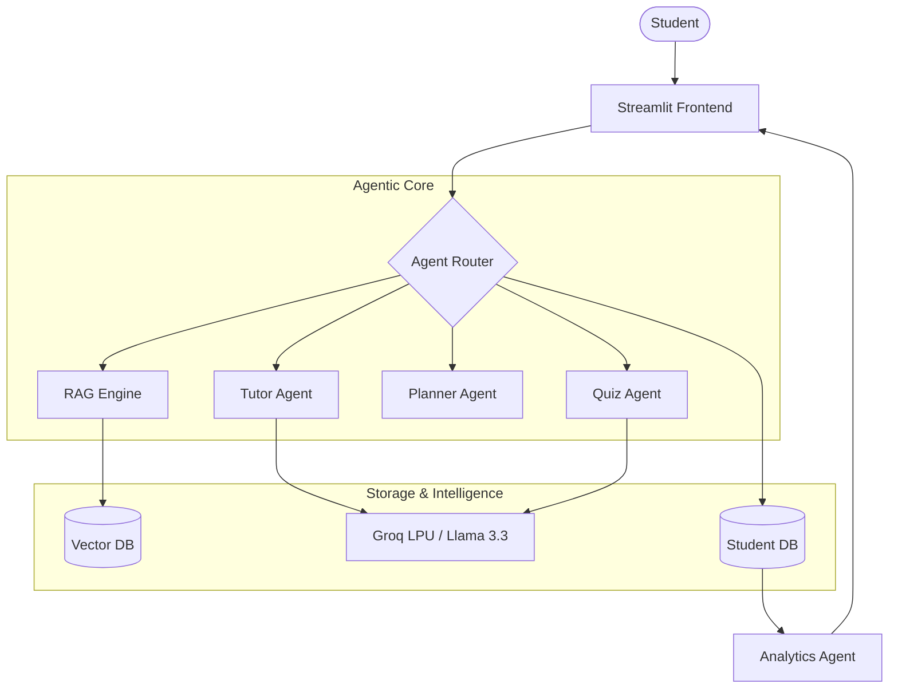

# 🎓 AI Tutor App: The Next-Gen Personalized Learning Platform

[](https://www.python.org/downloads/)
[](https://streamlit.io/)
[](https://groq.com/)
[](https://langchain.com/)

An enterprise-grade, multi-agent AI education platform designed to revolutionize the learning experience. Built with **Groq's LPU™ Inference Engine**, **LangChain**, and **Streamlit**, this application provides a hyper-personalized study companion that adapts to individual learning curves.

---

## 🌟 Vision
The AI Tutor App aims to bridge the gap between static content and active learning. By leveraging advanced LLMs and RAG (Retrieval-Augmented Generation), we provide students with an interactive environment that mimics a human tutor—patient, knowledgeable, and available 24/7.

## 🚀 Key Features

### 🧠 Intelligent Tutoring
- **Context-Aware Learning**: Adaptive tutoring that adjusts vocabulary and concept complexity based on the student's level (Beginner to Advanced).
- **Instant Doubt Resolution**: Specialized agent for breaking down complex equations, code, or theoretical concepts in real-time.

### 📝 Assessment & Practice
- **Dynamic Quiz Generation**: Real-time generation of MCQs and Short-Answer questions using LLM synthesis to ensure unique practice sets every time.
- **Timed Exam Mode**: Simulates high-pressure exam environments with progress tracking and automatic evaluation.

### 📅 Strategic Planning
- **AI Study Planner**: Generates optimized schedules based on exam dates, daily availability, and identified weak areas.
- **Smart Revision Sheets**: Summarizes lengthy topics into high-yield revision notes, formulas, and "cheat sheets."

### 📑 Knowledge Integration (RAG)
- **Document Intelligence**: Upload PDF, DOCX, or TXT files to create a private knowledge base. The tutor uses RAG to answer questions specifically from your uploaded study material.

### 📊 Performance Analytics
- **Gamified Progress**: Tracking streaks, daily goals, and performance trends using interactive Plotly dashboards.
- **Weakness Mapping**: Algorithmic identification of topics requiring further focus.

---

## 🏗 System Architecture



---

## 🛠 Technical Stack

| Category | Technology |
| :--- | :--- |
| **Frontend** | Streamlit (Custom Premium CSS) |
| **LLM Inference** | Groq API (Llama 3.3 70B, Mixtral, Gemma) |
| **Orchestration** | LangChain / LangGraph (Multi-Agent Patterns) |
| **Vector Search** | ChromaDB |
| **Database** | SQLite (Relational Student Data) |
| **Data Processing** | Pandas, PyPDF, Docx2Txt |
| **Visualization** | Plotly |

---

## ⚙️ Getting Started

### Prerequisites
- Python 3.13 or higher
- A [Groq Cloud API Key](https://console.groq.com/keys)

### Installation

1. **Clone the Project**
   ```bash
   git clone https://github.com/yourusername/ai-tutor-app.git
   cd ai_tutor_app
   ```

2. **Setup Virtual Environment**
   ```bash
   python -m venv venv
   source venv/bin/activate  # On Windows: venv\Scripts\activate
   ```

3. **Install Dependencies**
   ```bash
   pip install -r requirements.txt
   ```

4. **Environment Configuration**
   Create a `.env` file in the root directory:
   ```env
   GROQ_API_KEY=gsk_your_actual_key_here
   ```

### Running the Application
```bash
streamlit run app.py
```

---

## 📂 Repository Structure

- `app.py`: Entry point for the Streamlit dashboard.
- `utils/`: Core logic modules.
  - `tutor.py`: LLM logic for tutoring and doubt solving.
  - `rag_engine.py`: Document ingestion and vector search pipeline.
  - `quiz.py`: Logic for dynamic question generation.
  - `planner.py`: Scheduling and revision algorithms.
  - `db.py`: Persistence layer for student profiles.
  - `progress.py`: Data visualization and analytics.
- `data/`: Local storage for SQLite and temporary file uploads.
- `chroma_db/`: Persistent vector store for RAG functionality.

---

## 🔒 Security & Privacy
- **Local Persistence**: Student data is stored locally in SQLite, ensuring privacy.
- **Secure API Management**: API keys are managed via environment variables and never hardcoded.
- **RAG Privacy**: Uploaded documents are processed locally into ChromaDB and not used for training external models.

---

## 🗺 Roadmap
- [ ] **Multi-Modal Support**: OCR for handwritten notes and math problem images.
- [ ] **Voice Interaction**: Integration with Whisper and TTS for hands-free learning.
- [ ] **Collaboration Rooms**: Shared study sessions with peer-to-peer leaderboards.
- [ ] **LMS Integration**: Seamless export to Google Classroom and Canvas.

---

## 🤝 Contributing
Contributions are welcome! Please feel free to submit a Pull Request or open an issue for feature requests.

1. Fork the Project
2. Create your Feature Branch (`git checkout -b feature/AmazingFeature`)
3. Commit your Changes (`git commit -m 'Add some AmazingFeature'`)
4. Push to the Branch (`git push origin feature/AmazingFeature`)
5. Open a Pull Request

---

## 📄 License
Distributed under the MIT License. See `LICENSE` for more information.

---
Built with 💡 and 🎓 by **Antigravity AI**
