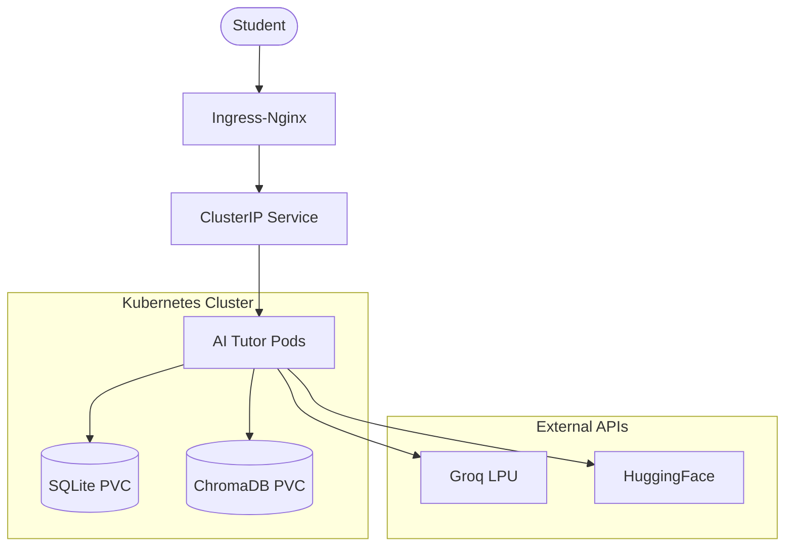

# 🎓 AI Tutor App: Production-Ready EdTech Platform

[](https://github.com/bittush8789/ai-tutor-platform/actions/workflows/deploy.yml)
[](https://kind.sigs.k8s.io/)
[](https://groq.com/)
[](https://kubernetes.io/docs/concepts/security/)

An enterprise-grade, cloud-native AI education platform. This repository transforms a specialized AI tutoring application into a highly scalable, secure, and observable production system using modern DevOps and LLMOps practices.

---

## 📖 Overview
The **AI Tutor Platform** leverages multi-agent orchestration to provide personalized learning experiences. By combining **LangChain** for logic, **Groq** for high-speed inference, and **Kubernetes** for robust infrastructure, we've created a system that is as reliable as it is intelligent.

### 🌟 Key Features
- **Adaptive Multi-Agent System**: Specialized agents for tutoring, quizzing, and planning.
- **RAG-Powered Intelligence**: Document ingestion and semantic search using ChromaDB.
- **Production-Grade K8s**: Multi-node KIND deployment with HPA, PVC, and Network Policies.
- **Zero-Downtime Updates**: Rolling update strategy with liveness and readiness probes.
- **Security First**: Non-root container execution and encrypted secret management.
- **Automated CI/CD**: End-to-end pipeline with security scanning and automated KIND testing.

---

## 🏗 Architecture
The system is designed for high availability and data persistence.


*For a detailed breakdown, see the [Architecture Guide](docs/ARCHITECTURE.md).*

---

## 🛠 Tech Stack
| Category | Technology |
| :--- | :--- |
| **Frontend/Backend** | Streamlit, LangChain, Python 3.11 |
| **Infrastructure** | Kubernetes (KIND), Docker |
| **Database** | SQLite (Relational), ChromaDB (Vector Store) |
| **AI/LLM** | Groq API (Llama 3.3 70B), HuggingFace Embeddings |
| **CI/CD** | GitHub Actions |
| **Monitoring** | Native K8s Probes, Prometheus/Grafana (Optional) |

---

## 🚀 Quick Start

### Local Development
```bash
pip install -r requirements.txt
streamlit run app.py
```

### Docker Run
```bash
docker build -t ai-tutor-app .
docker run -p 8501:8501 --env-file .env ai-tutor-app
```

### Kubernetes Deployment
```bash
# Detailed steps in docs/DEPLOYMENT_GUIDE.md
kind create cluster --config kind-config.yaml
kubectl apply -f k8s/
```

---

## 🔐 Security & Scaling
- **RBAC**: Fine-grained access control via ServiceAccounts.
- **Network Policies**: Restrict pod communication to minimize the attack surface.
- **Autoscaling**: HPA scales pods based on real-time CPU and Memory demand.
- **Resource Limits**: Guaranteed resources of 250m CPU / 512Mi Memory per pod.

---

## 📂 Documentation Suite
- 📘 [**Deployment Guide**](docs/DEPLOYMENT_GUIDE.md) - Exact commands for cluster setup.
- 🏗 [**Architecture**](docs/ARCHITECTURE.md) - Deep dive into system design.
- 📝 [**Implementation Steps**](docs/IMPLEMENTATION_STEPS.md) - Transformation methodology.
- 🔍 [**Troubleshooting**](docs/TROUBLESHOOTING.md) - Operational support guide.

---

## 🗺 Future Improvements
- **Observability**: Integration with LangSmith for LLM tracing and Loki for log aggregation.
- **External Vector DB**: Migration to Pinecone or Weaviate for global scaling.
- **Multi-Region**: Global deployment strategy with Cross-Region replication.

---

## 📄 License
Distributed under the MIT License.

Built with 💡 by **Antigravity AI**
