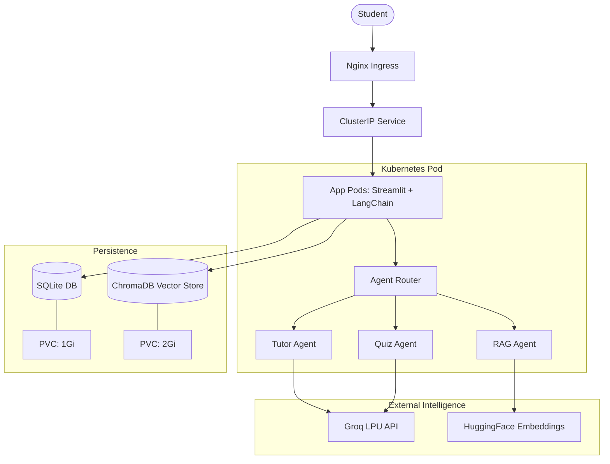
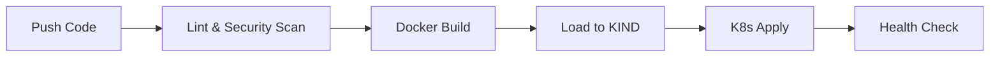

# 🏗 AI Tutor Platform: Architecture

## 🌐 High-Level Workflow

The AI Tutor Platform is built as a cloud-native, agentic application orchestrated by Kubernetes.

## 🛠 Component Breakdown

### 1. Frontend & Backend (Unified)
- **Streamlit**: Handles the UI and server-side logic in a single Python process.
- **LangChain**: Orchestrates the multi-agent system (Tutoring, Planning, Quizzing).

### 2. Persistence Layer
- **SQLite**: Stores student profiles, quiz scores, and study streaks. Mapped to a Persistent Volume to ensure data survives pod restarts.
- **ChromaDB**: High-performance vector database for RAG. Stores embeddings of student-uploaded documents.

### 3. LLMOps Layer
- **Groq LPU**: Used for ultra-fast inference with Llama 3.3.
- **Model Config**: Managed via K8s ConfigMaps to allow switching models without code changes.
- **Security**: API keys managed via K8s Secrets and injected as environment variables.

### 4. Infrastructure (DevOps)
- **KIND**: Local multi-node Kubernetes cluster for development and testing.
- **HPA**: Automatically scales the number of pods based on CPU and Memory utilization.
- **NetworkPolicy**: Restricts traffic to only allow Ingress and necessary Egress (API calls).

---

## 🔄 CI/CD Flow

## 📊 Monitoring & Logging
- **Health Checks**: Liveness and Readiness probes hit `/_stcore/health`.
- **Structured Logs**: Application logs are sent to `stdout` for collection by Fluentd/Loki (standard K8s pattern).
